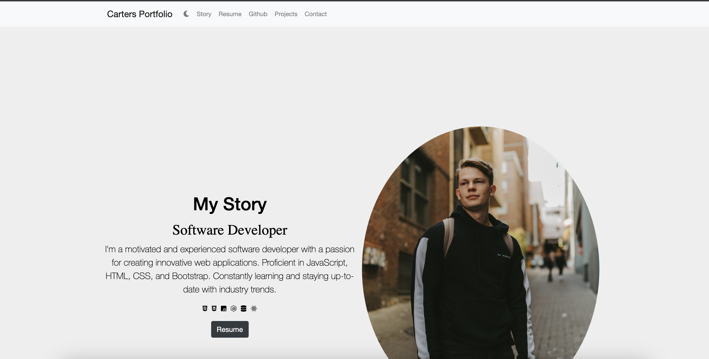

# Carters_Portfolio
`This project showcases a simple but effective porfolio, with my best projects to the date.`

# Webpage 
https://carternadain.github.io/Carters_Portfolio/

# Getting Started
If you'd like to use this porfolio yourself feel free to copy this code you will just git clone the `https` link onto your machine. To clone this you would open your terminal window `cd` where you want the file to go then write `git clone examplelink` then open up the new project in your favorite code writer. 

# Application in use

# Prerequisites
`google chrome`
`vscode`

# Built With 
`javescript`
`bootstrap`
`html`
`css`

# Authors
https://github.com/carternadain